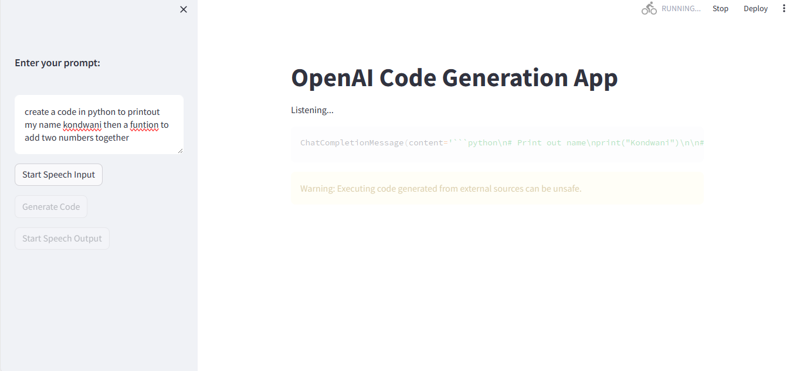

# GEC (Genius Code Editor and Creator) Chat Bot


## Overview

GEC (Genius Code Editor and Creator) is a Streamlit web app powered by OpenAI's GPT-3.5 model. It assists users in generating code by providing a natural language prompt. The app leverages the capabilities of OpenAI's model to understand user prompts and generate corresponding code. If there are any errors in the generated code, the app iteratively refines the prompt to correct them, ensuring high-quality code output.

## Features

- **Code Generation**: Users can input prompts describing the code they need, and the app generates the corresponding code using OpenAI's GPT-3.5 model.
- **Error Handling**: The app detects errors in the generated code and iteratively refines the prompt to correct them, ensuring the accuracy of the code.
- **Speech Input**: Users can utilize speech commands to input prompts, enhancing accessibility and user experience.

## Usage

1. **Installation**:
   - Install the required dependencies by running the following command:

     ```bash
     pip install streamlit openai speech_recognition pyttsx3
     ```

2. **Running the App**:
   - Start the Streamlit app by running:

     ```bash
     streamlit run app.py
     ```

3. **Using Speech Commands**:
   - Click on the "Start Speech Input" button in the sidebar to initiate speech input.
   - Speak your prompt into the microphone. The app will transcribe the speech into text and display it in the prompt input field.

4. **Generating Code**:
   - Enter your prompt in the input field and click on the "Generate Code" button.
   - If there are errors in the generated code, they will be displayed along with a text area to modify the prompt.
   - Click on the "Generate Code with Modified Prompt" button to re-generate the code with the modified prompt.
   - Repeat the process until no errors remain in the generated code.

## Demo




## Contributing

Contributions are welcome! Please fork the repository and submit a pull request with your improvements.

## License

MIT License
---

Feel free to further customize the `README.md` file according to your preferences and requirements.